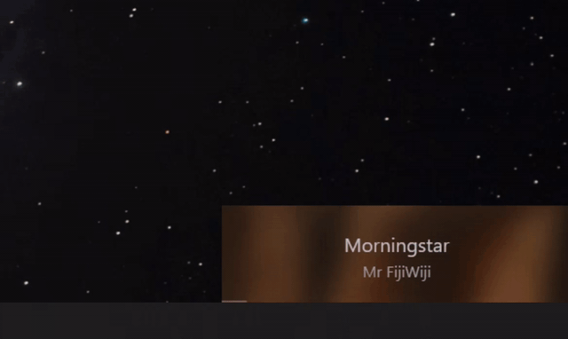
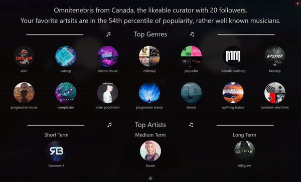
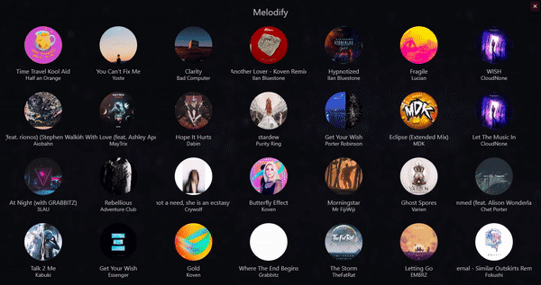

# Melodify

Yet another spotify client that focuses on presentation and user statistics, exposing a number of API calls.  
This program uses [SpotifyAPI-NET](https://github.com/JohnnyCrazy/SpotifyAPI-NET) in a WPF .NET Core application.

## Features

<table style="text-align:center;">
  <tr>
    <td>Miniplayer with playing track info</td>
    <td>Progress bar and controls</td>
    <td>Full screen view with album art</td>
  </tr>
  <tr>
    <td>Playlist control and playback</td>
    <td>Top songs playback and preview</td>
    <td>Favorite song from miniplayer</td>
  </tr>
  <tr>
    <td>Music Videos in full screen</td>
    <td>Full user statistics and info</td>
    <td>🚧 .NET 5.0 🚧</td>
  </tr>
</table>

## Overview

The default view of the application! Click the gifs for a sound preview.

Hovering over it reveals four buttons that perform the following:

Location | Symbol | Purpose
:---: | :---: | ---
↖|`⛶`|Expands the program to be fullscreen with blur
↗|`∞`|Menu with various views based on your taste
↙|`≡`|Opens the playlist view, public and private
↘|`♡`|Likes a song, adding it to your favorite tracks

Mouse clicks and Keyboard controls are also supported.

Color | Keystroke | Purpose
:---: | :---: | ---
Green | `spacebar` | Plays/Pauses current song
Blue | `left`/`right` | Returns to previous song or skips current song
Black | ⠀ | Allows dragging of window to desired location
⠀ | `f` | Resizes to fullscreen

#### User Info View (click for sound)

#### Top Songs View (click for sound)

#### Top Artists View (click for sound)

#### Fullscreen View

## Installation

 #### Windows Users
>
> Go to the [Releases](https://github.com/novatorem/Melodify/releases) page and download the latest release

Currently only supports Windows 10, planning on further expansion if this picks up.

## Development setup

Developed on Visual Studio 2019 - a WPF application using .NET

You'll need to get your own Spotify API and YouTube API access.
Set up a Resources.resx file under the Solution Properties.
You'll then need three variables, with their respective keys:
- SpotID
- SpotSecret
- YoutubeAPI

## Known Issues

- Running as an admin breaks the music video feature

## Various Views

Just to give an idea on what it generally looks like, the miniature view blurs and darkens the album art and uses it as the background as such:

